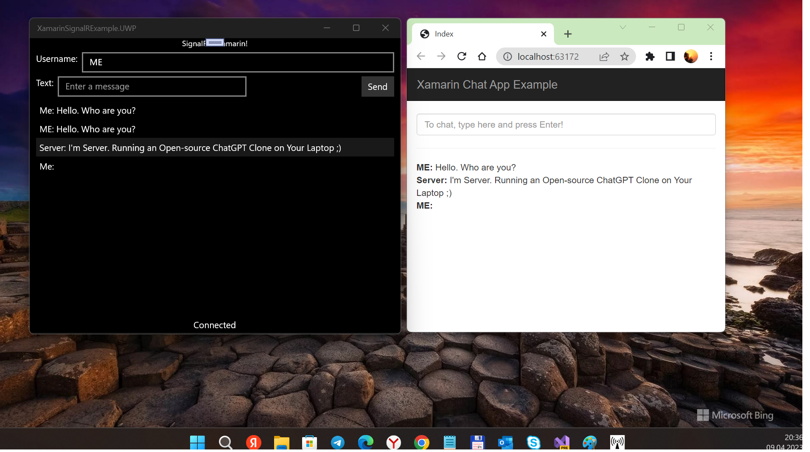

# SignalX
My fork of old sweet [Xamarin-Forms-and-SignalR-Example](https://github.com/schneidenbach/Xamarin-Forms-and-SignalR-Example).

## About 
A simple multi-platform implementation of a Xamarin.Forms app mixed with SignalR. ;)

## Screenshots

## Tech. moments

### Solution's Architecture
- Client (SignalX shared project; SignalX.UWP, SignalX.Droid, SignalX.iOS target-dependant projects)
- Server (SignalX.Server project)

## Tuning
When web-service started (for testing) at your side, the port may be different.
Search "http://localhost:63172", and set your own port. Also you may change "localhost" string (if you have some nice and small Asp.Net server...) :)

There are 2 files to "patch":
- jquery-16.4-vsdoc.js (maybe, it needed for "inline chat" at Server side only)
- XamarinSignalRExample.cs (Client side)

## Ideas
- Multidevice "smart home" (some messages between "home ecosystem").
- ChatGPT implementation... why not? =)

## ..
AS IS. No support. RnD only.

## .
[m][e] 2023

